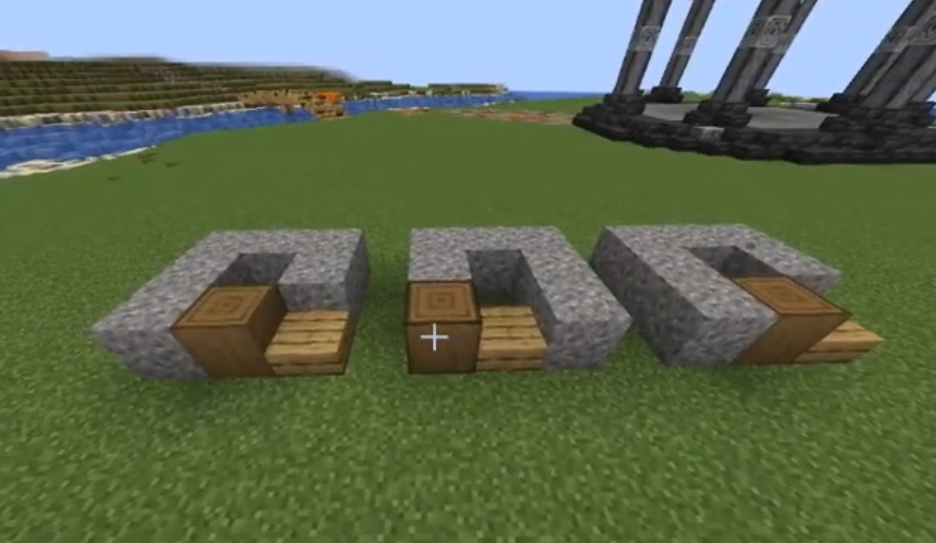

DynamicBuild is a plugin for minecraft servers.

## Installation
1. Download the plugin from spigotmc.org
2. Put the plugin in the plugins folder of your server
3. Restart the server

## Usage
1. Use `/buildmode` to toggle build mode for yourself
2. take a wooden shovel and right click for set origine point (north-west down corner)


3. take a wooden hoe and right click for set firt point and left click for set second point (same worldEdit)


4. use `/addbuild <name> <frameTick> <airReplace>` to add a build
5. repeat step 3 and 6 for add more build
6. use `/addbuild <name>` to add build to existing build
7. use `/activatebuild <name> <true/false>` to activate or deactivate a build
8. use `/settickinterval <name> <frameTick>` to set the frame tick interval for a build

## Features
- [x] Easy to use
- [x] Multi-version support
- [x] Multi-language support

## Upcoming features
- [ ] Add more commands
- [ ] Add more permissions
- [ ] Add more configuration options
- [ ] Add more languages
- [ ] Add gui support
- [ ] Add more features

## Commands
- `/buildmode` - Toggles build mode
- `/buildmode <player>` - Toggles build mode for a player
- `/addbuild <name> <frameTick> <airReplace>` - Adds a build
- `/addbuild <name>` - Adds build to existing build
- `/delbuild <name>` - Removes a build
- `/listbuilds` - Lists all builds
- `/activatebuild <name> <true/false>` - Activates or deactivates a build
- `/settickinterval <name> <frameTick>` - Sets the frame tick interval for a build

## Permissions
- `dynamicbuild.buildmode` - Allows player to use build mode
- `dynamicbuild.addbuild` - Allows player to add a build
- `dynamicbuild.delbuild` - Allows player to remove a build
- `dynamicbuild.listbuilds` - Allows player to list all builds
- `dynamicbuild.activatebuild` - Allows player to activate or deactivate a build
- `dynamicbuild.settickinterval` - Allows player to set the frame tick interval for a build
- `dynamicbuild.*` - Allows player to use all commands

## Configuration
```yaml
# DynamicBuild configuration
defaultMode: false # Default build mode
tickInterval: 1 # Minimal frame tick interval (20 ticks = 1 second)
```


## Tutorial
[](https://youtu.be/JS1mMQuLf1E)
## Credits
- author: [Mr_Qsdf] (https://github.com/mrqsdf)
- contributors: [Mr_Qsdf]